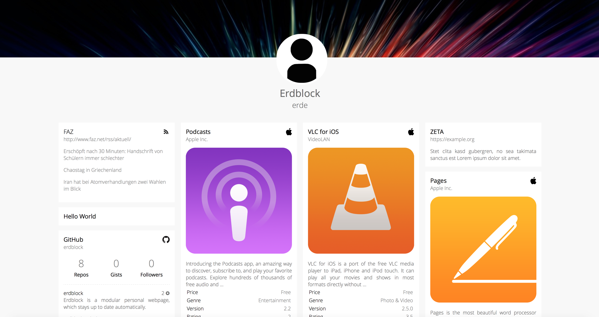
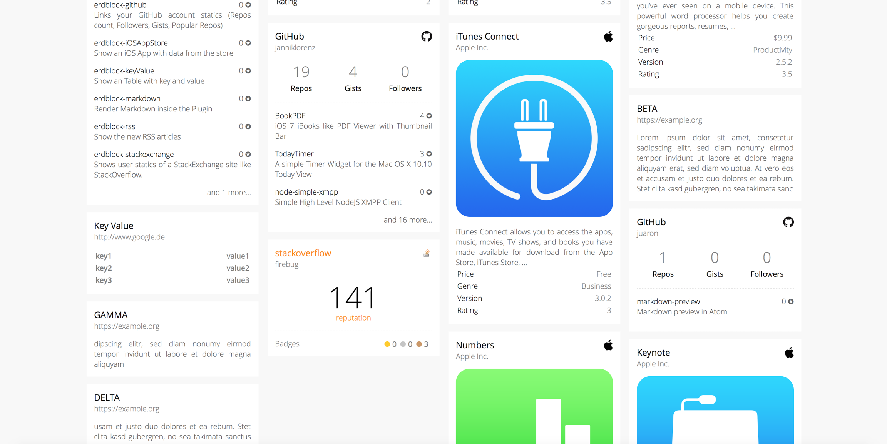

# Erdblock Demo
This repo demonstrates a simple way to set up erdblock as a single instance. The plugins are declared and configured in the `index.js`.




## Install

```` bash
# clone Repo
git clone git@github.com:erdblock/demo.git

# install NPM dependencies
npm install

# setup config
nano index.js

# run
node index.js
````
